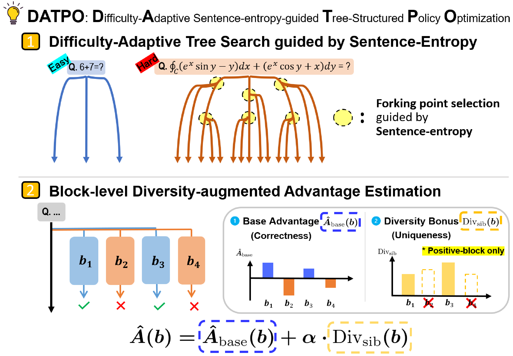

# DATPO: Difficulty-Adaptive Sentence-Entropy-guided Tree-structured Policy Optimization



## 📰 News

- 🎉 **DATPO has been accepted to Findings of EMNLP 2026!**

## 🔍 Overview

**DATPO** is a reinforcement learning with verifiable rewards (RLVR) method that improves reasoning coverage—especially `pass@k`—by changing the structure of training-time rollouts. Instead of drawing only fixed parallel samples, DATPO builds a rollout tree and allocates more branch exploration to harder prompts.

At a glance, DATPO provides:

- **Difficulty-adaptive tree search:** Root rollouts estimate prompt difficulty, so harder prompts receive more forking points and branch rollouts.
- **Sentence-entropy-guided forking:** Branch points are selected at the sentence level, avoiding repeated exploration inside a narrow high-entropy token region.
- **Block-level diversity-augmented advantage:** The rollout tree is partitioned into contiguous blocks, and positive-advantage blocks receive an annealed sibling-diversity bonus.

## 🌳 Method

The policy is optimized with a block-level clipped policy-gradient objective over the generated tree. Each block uses the augmented advantage

$$
\hat{A}(b)
= \hat{A}_{\mathrm{base}}(b)
+ \mathbb{I}\!\left(\hat{A}_{\mathrm{base}}(b) > 0\right)
\cdot \alpha \cdot \mathrm{Div}_{\mathrm{sib}}(b),
$$

where $\mathrm{Div}_{\mathrm{sib}}(b)$ measures the semantic distance from sibling blocks and $\alpha$ is annealed during training.

The corresponding DATPO objective is

$$
\begin{aligned}
\mathcal{J}_{\mathrm{DATPO}}(\theta)
&= \mathbb{E}_{q \sim \mathcal{Q},\, \mathcal{B} \sim \pi_{\theta_{\mathrm{old}}}}
\Bigg[
\frac{1}{\sum_{b \in \mathcal{B}} |b|}
\sum_{b \in \mathcal{B}} \sum_{t=1}^{|b|}
\\
&\quad
\min \Big(
\rho_{b,t}(\theta)\hat{A}(b),
\mathrm{clip}\big(\rho_{b,t}(\theta), 1-\epsilon, 1+\epsilon\big)\hat{A}(b)
\Big)
\Bigg].
\end{aligned}
$$

## 🚀 Quick Start

```bash
git clone https://github.com/colin31472/DATPO.git
cd DATPO

python -m venv .venv
source .venv/bin/activate
python -m pip install --upgrade pip
python -m pip install -r requirements.txt --extra-index-url https://download.pytorch.org/whl/cu124
```

Next, download the dataset and model as described below, then start training:

```bash
python train.py --config config.yaml
```

## 🛠️ Environment Setup

The package versions used for the experiments are pinned in [requirements.txt](requirements.txt). The pinned PyTorch build targets **CUDA 12.4**. If your CUDA version differs, install the matching [PyTorch build](https://pytorch.org/get-started/locally/) first and then install the remaining dependencies.

On Windows PowerShell, activate the virtual environment with:

```powershell
.\.venv\Scripts\Activate.ps1
```

## 📦 Model and Dataset

The base model and dataset are not included in this repository. From the repository root, download the MATH dataset and Qwen2.5-3B model:

```bash
git lfs install
git clone https://huggingface.co/datasets/nlile/hendrycks-MATH-benchmark
git clone https://huggingface.co/Qwen/Qwen2.5-3B
```

The default [config.yaml](config.yaml) expects the following paths:

| Resource | Default path |
| --- | --- |
| MATH dataset | `hendrycks-MATH-benchmark/data` |
| Pretrained model | `Qwen2.5-3B` |

To use different locations, update `data.root_path` and `model.pretrained_model_path` in `config.yaml`.

## ⚙️ Configuration

All experiment settings are defined in [config.yaml](config.yaml). The main DATPO controls are:

| Setting | Description |
| --- | --- |
| `enabled` | Enables DATPO tree-structured rollouts; set to `false` for the GRPO path. |
| `root_rollouts` | Number of initial rollouts used to estimate prompt difficulty. |
| `adaptive` | Enables difficulty-adaptive allocation. |
| `er_max` | Maximum number of additional exploration rounds. |
| `bp_max` | Maximum number of branch points. |
| `bn_max` | Maximum number of branch rollouts per branch point. |
| `fork_selection` | Fork-point selection strategy; the default is `sent-entropy`. |
| `divergence_alpha` | Initial weight of the sibling-diversity bonus. |
| `divergence_alpha_min` | Minimum diversity-bonus weight after annealing. |

Training, checkpoint, evaluation, and logging settings are grouped under `training` in the same file.

## 🏋️ Training

Launch an experiment from the repository root:

```bash
python train.py --config config.yaml
```

By default:

- checkpoints are written to `ckpt/datpo`;
- TensorBoard logs are written to `logs/datpo`;
- evaluation runs every 40 global steps; and
- checkpoints are saved every 100 global steps.

Monitor a run with:

```bash
tensorboard --logdir logs/datpo
```

## 🗂️ Repository Structure

```text
DATPO/
├── datpo/
│   ├── training/tree_search.py  # Adaptive rollout-tree construction
│   ├── utils/token_stats.py     # Entropy and sentence-boundary utilities
│   └── config.py                # Tree-search configuration objects
├── figure/                      # Method overview assets
├── config.yaml                  # Default experiment configuration
├── datpo_zero.py                # DATPO integration with the training backend
├── grpo.py                      # GRPO rollout and optimization utilities
├── math_dataset.py              # MATH loading, prompts, and reward checks
├── qwen2_model.py               # Qwen2 model implementation
├── train.py                     # Main training entry point
└── requirements.txt             # Pinned Python dependencies
```

## 🙏 Acknowledgements

This implementation was developed based on [policy-gradient/GRPO-Zero](https://github.com/policy-gradient/GRPO-Zero). We thank the authors for releasing their code.
